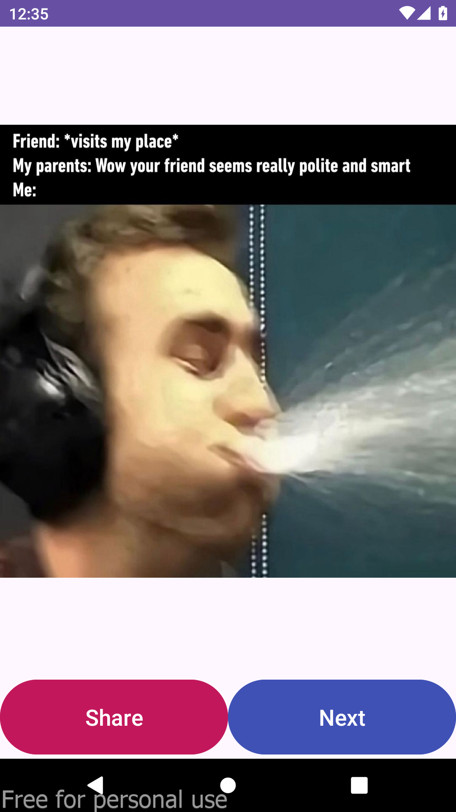

# Random Meme App

Welcome to the Random Meme app! This is my second Android app project, created as part of my journey in learning Android development.

## Description

The Random Meme app allows you to discover and share hilarious memes from around the web. With just a tap, you can view a random meme and easily share it with your friends.

## Screenshots

  

## Features

- Fetches random memes from an external API
- Allows users to share memes with friends
- Simple and intuitive user interface

## Getting Started

To run this project locally, follow these steps:

1. Clone this repository.
2. Open the project in Android Studio.
3. Run the app on an emulator or physical device.

## Usage

Once installed, open the Random Meme app and tap on the "Next" button to view a random meme. You can then tap on the "Share" button to share the meme with your friends.

## Credits

- This app uses the [Meme API](https://meme-api.com/gimme) to fetch random memes.

